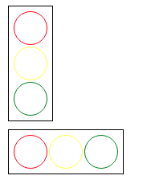

1. Stwórz w możliwie jak najprostszy sposób i używająć możliwie mało klas
rozwiązanie które wyświetli światła w pionie i poziomie.
2. Staraj się nie edytować `HTML`, w kodzie znajdziesz informacje jakie
ewentualne zmiany są dozwolone.
3. Jak widzisz uzywamy tutaj listy na tej stronie znajdziesz inspiracje jak
można do tego podjeść. https://www.w3schools.com/css/css_navbar.asp

Rezultat jaki powinieneś osiągnąć:

Powodzenia!
